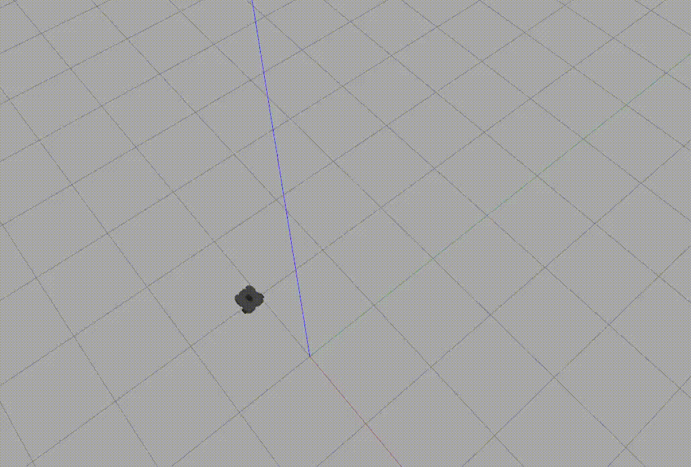

# warmup_project
# Joyce Passananti

<h2>Driving in a square Robot Behavior:</h2>

- We need the robot to drive in a square, which we can accomplish by setting the robot's velocity to a certain constant for a certain amount of time, then using angular velocity to rotate the robot 90 degrees and move in that direction for the same length of time, and so on until the robot has completed the square. Elements of this problem include limitations of our robot's movement in that it can only move forward/backward and not to the side, which is solved by changing the angular velocity.This was accomplished with cmd_vel using Twist and Vector 3 types from geometry_msgs to publish the angular and linear velocities.

- The init self function creates th node that we will publsih our commands to, and we set the initial angular and linear velocities for the robot. The run function uses rospy.Rate to specify the rate of our loop to 1 Hz and initializes our timer to 0, and the conditional changes the angular velocity to rotate the robot 90 degrees only every 10 iterations (through the loop) and then publishes these changes.
- Recorded gif: 

<h2>Wall Follower Robot Behavior:</h2>

- We need the robot to follow the walls, and turn when it reaches a corner/edge. The main problem is figuring out how you want the robot to follow it, which in my case i accomplished by checking the different areas around the robot for different objects/walls. If there's a wall to the right and nothing in front, the robot will move forward. If there is a wall in front of the robot it will turn to the left until the wall is on the right and there is nothing in front, then move forward. if there are no objects near the robot it will turn/go forward and wander until it senses a wall. Movement was then accomplished with sensor_msgs using LaserScan and cmd_vel using Twist and Vector 3 types from geometry_msgs to publish the angular and linear velocities.

- The init self function creates the node that we will publsih our commands to, and we set the initial angular and linear velocities for the robot and also contains a call to process_scan. Process scan finds the shortest distance from the robot to anything in 3 different directions: the front, front right, and front left. The function then sets the angular/linear velocities acording to the cases described above. The run function keeps the program running constantly.
- Recorded gif: 

<h2>Person Follower Robot Behavior:</h2>

- We need the robot to follow a person, which we can accomplish by using LaserScan from sensor msgs to find the object closest to the robot. Finding the shortest distance in the range scan and using its index in the scan array to determine the angle from where the robot was pointing allows us to know where to turn. Once the angular velocity has been correctly set, the robot moves linearly forward (while still rotating to account for any changes).  This was accomplished with cmd_vel using Twist and Vector 3 types from geometry_msgs to publish the angular and linear velocities.

- The init self function creates the node that we will publsih our commands to, and we set the initial angular and linear velocities for the robot and also contains a call to process_scan. Process scan finds the shortest distance from the robot to anything, finds the index of that distance in the ranges array and uses that index to set the angular velocity of the robot. When close to the object, it sets the linear velocity to 0 so the robot maintains a safe distance while still being able to point/turn in the correct direction. The run function keeps the program running constantly.
- Recorded gif: 

<h2>Challenges:</h2>
    The main challenge I faced was working with the output from LaserScan- I  was very confused as I thought the ranges array was supposed to get the distance to the closest obstacle at each angle, however it would often output inf or nan even when surrounded by  walls on all sides. It was very frustrating before I realized that it was simply maxing out (that the scan had limited range) as it would break all my if statements/functions to determine the smallest distance. I mostly just kept changing my code and trying different methods of acheiving the same outcome that avoided these errors, however eventually figured it out and was able to solve it with a simple min() function with the max range of ~3.5.

<h2>Future Work:</h2>
    If I had more time I would definitely play around with the movement of the robot when following something that requires changing both linear and angular velocity. While I feel my program does an adequate job, it could be much smoother. In additin, for the person follower I have a small buffer for the angle that mostly smooths out the movement while still having the robot follow the object pretty much exactly, but I would like to see if there's a way to make it more precise without sacrificing time/smoothness of movement.

<h2>Takeaways:</h2>

    1. I spent a long time trying to make my initial solution for wall follower work, however never had success with that method. I then took a break, thought about how I wanted to solve it (from the beginning) and designed a new solution which I was able to make work. I think looking for other ways of solving a problem instead of just trying to fix the broken solution is a big takeaway for me for the future, and will hopefully help in debugging/arriving at a working solution.
    
    2. Understanding the correlation between angle and index for the range away was something i didn't realize at first, but really helped me once I did. I also didn't know that scan had a range maximum, So I guess my main take away would just be to make sure I'm familiar with the topics/messages I'm using (beyond what rostopic info/rosmsg show tell you).